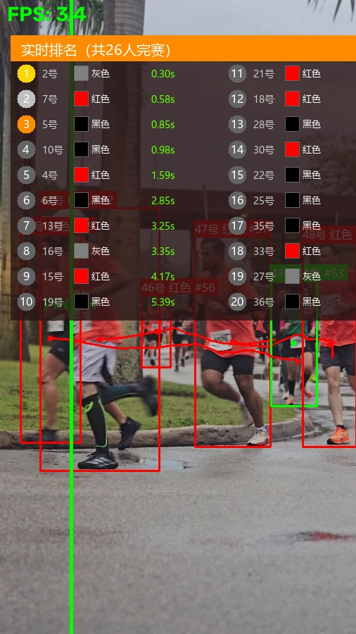
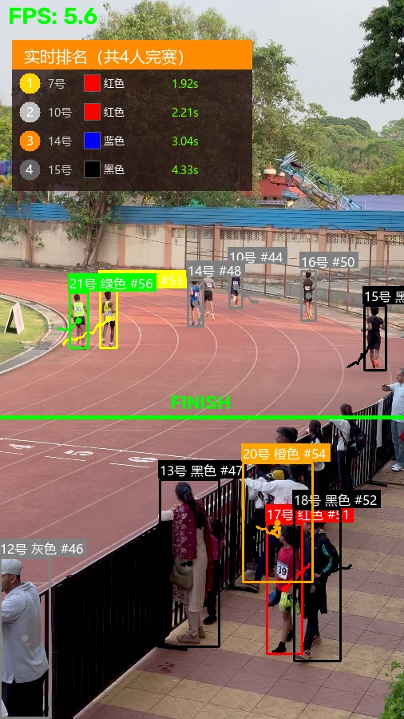

# TrackVerse - 多目标智能追踪与过线计时系统

> 🚀 基于 YOLOv8 + ByteTrack 的实时多目标追踪 · 过线计时 · 颜色识别 · 客流分析
>
> 🎯 Anker首届黑客松挑战赛 - 智能安防赛道 · 「追迹」项目

<p align="center">
  <b>Track</b> every target. <b>Verse</b> every scenario.
</p>

---

## 项目简介

**TrackVerse** 是一个基于 eufy SoloCam E30 摄像头的多目标智能追踪系统。通过 YOLOv8 目标检测 + ByteTrack 多目标追踪，实现过线计时、颜色识别、客流统计、行为分析等 AI 能力。一套算法，覆盖比赛计时、安防监控、客流分析等多场景。

## 🌟 多场景应用

TrackVerse 基于统一的 YOLO + ByteTrack 技术底座，支持多种场景快速切换：

| 场景 | 核心能力 | 应用价值 | 状态 |
|------|---------|---------|------|
| 🏃 **竞速跑步计时** | 过线检测 + 实时排名 + 颜色识别 | 运动会、路跑赛事自动计时排名 | ✅ 已完成 |
| 🛍️ **商场客流分析** | 区域计数 + 方向统计 + 停留时间 | 门店选址、动线优化、高峰预警 | ✅ 算法完成 |
| 💪 健身动作识别 | 姿态估计 + 动作计数 + 标准度评估 | 居家健身指导、动作矫正 | 📋 规划中 |
| 🐱 宠物行为监控 | 宠物检测 + 行为分类 + 日常记录 | 宠物看护、健康监测 | 📋 规划中 |
| 🚶 区域入侵检测 | 虚拟围栏 + 徘徊检测 + 事件告警 | 安防监控、周界防护 | 📋 规划中 |

> 一套算法底座，多个场景模块。核心检测与追踪算法复用率 >80%，新增场景只需开发业务逻辑层。

## ✨ Demo效果

### 场景一：路跑比赛（26人完赛）

路跑比赛视频（26人完赛，12秒）：

| 指标 | 结果 |
|------|------|
| 视频时长 | 12.4s |
| 处理速度 | 6.0 FPS (CPU) |
| 同帧最多目标 | 8人 |
| 独立追踪ID | 48个 |
| 完赛人数 | 26人 |
| 计时精度 | 0.01秒 |

最终排名（前8）：

| 名次 | 选手 | 衣服颜色 | 冲线时间 |
|------|------|---------|---------|
| 🥇 1 | 2号 | 灰色 | 0.30s |
| 🥈 2 | 7号 | 红色 | 0.58s |
| 🥉 3 | 5号 | 黑色 | 0.85s |
| 4 | 10号 | 黑色 | 0.98s |
| 5 | 4号 | 红色 | 1.59s |
| 6 | 6号 | 黑色 | 2.85s |
| 7 | 13号 | 红色 | 3.25s |
| 8 | 16号 | 灰色 | 3.35s |



### 场景二：场地冲刺（真实跑道）

标准田径场冲刺视频（4人完赛，6.7秒），终点线对齐跑道白色标线：

| 指标 | 结果 |
|------|------|
| 视频时长 | 6.7s |
| 处理速度 | 4.0 FPS (CPU) |
| 同帧最多目标 | 11人 |
| 独立追踪ID | 21个 |
| 完赛人数 | 4人 |
| 视频分辨率 | 2160x3840 (4K竖屏) |

最终排名：

| 名次 | 选手 | 衣服颜色 | 冲线时间 |
|------|------|---------|---------|
| 🥇 1 | 7号 | 红色 | 1.92s |
| 🥈 2 | 10号 | 红色 | 2.21s |
| 🥉 3 | 14号 | 蓝色 | 3.04s |
| 4 | 15号 | 黑色 | 4.33s |



## 技术架构

```
eufy SoloCam E30 (Web SDK取流)
        ↓ 截图帧
    YOLOv8 目标检测          ← 找到人
        ↓
    ByteTrack 多目标追踪      ← 追踪同一个人
        ↓
    ┌──────────────────┐
    │  过线检测+计时    │ ← 比赛计时
    │  颜色识别(HSV)    │ ← 人员分类
    │  选手编号分配     │ ← 位置管理
    │  客流统计         │ ← 区域监控
    │  行为分析         │ ← 异常检测
    └──────────────────┘
        ↓
    可视化输出 + 排名面板
```

## 核心技术

| 模块 | 技术 | 说明 |
|------|------|------|
| 目标检测 | YOLOv8n | 每帧检测画面中的人，输出位置框+置信度 |
| 多目标追踪 | ByteTrack | 跨帧关联同一人，分配唯一追踪ID |
| 颜色识别 | HSV色彩空间 | 在检测框区域内分析主色调 |
| 过线计时 | 几何交叉判断 | 判断目标中心点是否穿过终点线 |
| 选手编号 | 位置排序 | 起跑时按位置从左到右分配1号、2号... |
| 行为分析 | 速度+轨迹分析 | 检测奔跑、逗留、静止等行为 |

## 🔮 后续规划

当前颜色识别基于 HSV 色彩空间，适用于光照稳定的场景。后续计划升级为深度学习方案：

| 方向 | 方案 | 预期提升 |
|------|------|---------|
| **颜色分类器** | EfficientNet-B0 迁移学习 | 准确率从 ~70% → 90%+，抗光照变化 |
| **行人重识别** | ResNet50 + ReID | 解决追踪ID切换问题，长时追踪更稳定 |
| **行为识别** | SlowFast / 3D ResNet | 更精细的行为分类（跌倒、奔跑、徘徊） |
| **模型部署** | TensorRT / ONNX 量化 | CPU推理速度提升 2-3 倍 |

颜色分类器将在当前 HSV 模块的基础上无缝替换，接口保持一致，已有代码无需改动。

## 代码结构

```
├── ai/                          # 核心AI算法
│   ├── engine.py               # AI引擎 - 协调所有模块
│   ├── tracker.py               # YOLO检测 + ByteTrack追踪
│   ├── line_crossing.py         # 过线检测 + 计时排名
│   ├── clothing_color.py       # 衣服颜色识别(HSV)
│   ├── lane_assigner.py        # 选手编号分配
│   ├── crowd_counter.py        # 客流统计
│   ├── behavior_analyzer.py    # 行为分析
│   └── text_renderer.py        # 中文渲染(PIL)
├── backend/
│   └── main.py                 # FastAPI后端服务
├── demo_racing.py              # 竞速Demo入口（实时窗口）
├── demo_crowd.py               # 客流Demo入口
├── run_analysis.py             # 自动化分析脚本（一键生成报告）
├── requirements.txt            # Python依赖
├── output/demo/                # 分析结果
│   ├── annotated.mp4           # 标注视频(16MB)
│   ├── demo_preview.mp4        # 压缩预览版(3.2MB)
│   ├── result.jpg              # 最终排名截图
│   ├── report.html             # HTML可视化报告
│   ├── report.json             # JSON数据报告
│   └── frame_log.csv           # 逐帧CSV日志
└── screenshots/               # 效果截图
```

## 快速开始

### 1. 安装依赖

```bash
pip install -r requirements.txt
```

> 国内用户推荐使用清华镜像源：
> `pip install -r requirements.txt -i https://pypi.tuna.tsinghua.edu.cn/simple`

### 2. 自动化分析（推荐，一键生成报告）

输入一个视频，自动生成标注视频+截图+HTML报告+JSON+CSV日志：

```bash
# 基本用法
python run_analysis.py --video your_video.mp4

# 完整参数（竖屏视频，终点线在画面中间）
python run_analysis.py --video your_video.mp4 --line-orientation vertical --line-pos 0.5 --auto-start 1 --lane-direction vertical

# 横屏视频
python run_analysis.py --video your_video.mp4 --line-orientation horizontal --line-pos 0.8 --auto-start 1 --lane-direction horizontal
```

输出目录：`output/视频名/`
- `annotated.mp4` — 标注后的视频
- `result.jpg` — 最终排名截图
- `report.html` — HTML可视化报告（浏览器打开即可）
- `report.json` — JSON数据报告
- `frame_log.csv` — 逐帧检测日志

### 3. 实时窗口Demo（交互式）

```bash
# 用视频文件
python demo_racing.py --video your_video.mp4 --line-orientation vertical --line-pos 0.5 --auto-start 1 --lane-direction vertical

# 用电脑摄像头
python demo_racing.py --video 0

# 保存结果
python demo_racing.py --video your_video.mp4 --save output.mp4 --save-frame result.jpg
```

### 4. 查看分析报告

```bash
# 打开HTML报告
start output/your_video/report.html

# 播放标注视频
start output/your_video/annotated.mp4
```

## 参数说明

| 参数 | 默认值 | 说明 |
|------|--------|------|
| `--video` | 必填 | 视频路径，`0`为摄像头 |
| `--model` | yolov8n.pt | YOLO模型路径 |
| `--line-orientation` | vertical | 终点线方向：vertical(竖线) / horizontal(横线) |
| `--line-pos` | 0.5 | 终点线位置（0-1，0.5=画面中间） |
| `--auto-start` | 1 | 第几帧自动开始比赛 |
| `--lane-direction` | vertical | 编号分配方向：vertical(从上到下) / horizontal(从左到右) |
| `--max-width` | 720 | 显示窗口最大宽度 |
| `--max-height` | 900 | 显示窗口最大高度 |
| `--save` | 无 | 保存输出视频路径 |
| `--save-frame` | 无 | 保存最终截图路径 |

## 实时窗口操作

| 按键 | 功能 |
|------|------|
| S | 开始比赛（锁定选手编号） |
| R | 重置比赛 |
| 空格 | 暂停/继续 |
| Q | 退出 |

## ✨ Demo效果

以路跑比赛视频为例（8-10人跑步，12秒）：

| 指标 | 结果 |
|------|------|
| 总帧数 | 367 |
| 视频时长 | 12.4s |
| 处理速度 | 6.0 FPS (CPU) |
| 同帧最多目标 | 8人 |
| 独立追踪ID | 48个 |
| 完赛人数 | 26人 |

最终排名（前8）：

| 名次 | 选手 | 衣服颜色 | 冲线时间 |
|------|------|---------|---------|
| 🥇 1 | 2号 | 灰色 | 0.30s |
| 🥈 2 | 7号 | 红色 | 0.58s |
| 🥉 3 | 5号 | 黑色 | 0.85s |
| 4 | 10号 | 黑色 | 0.98s |
| 5 | 4号 | 红色 | 1.59s |
| 6 | 6号 | 黑色 | 2.85s |
| 7 | 13号 | 红色 | 3.25s |
| 8 | 16号 | 灰色 | 3.35s |

> 完整排名及详细数据见 `output/demo/report.html`

## 硬件选型

| 设备 | 型号 | 能力 |
|------|------|------|
| 主摄像头 | eufy SoloCam E30 (T8171) | 360°云台、AI自动追踪、2K画面 |
| 辅助摄像头 | eufy Video Doorbell E340 (T8214) | 双摄模式、下摄视角 |

## 技术约束

- App SDK：事件 → 缩略图 → AI分析
- Web SDK：取流 → 截图 → AI分析
- 不支持实时视频流分析，采用帧截图分析模式

## 团队

- 刘云龙 - 算法+后端+架构
- 李雪微 - UI设计
- 董哲宇 - 前端开发
- 朱依静 - 客流模块+文案
